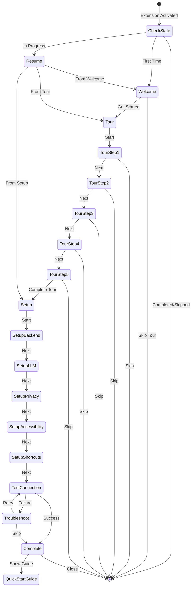
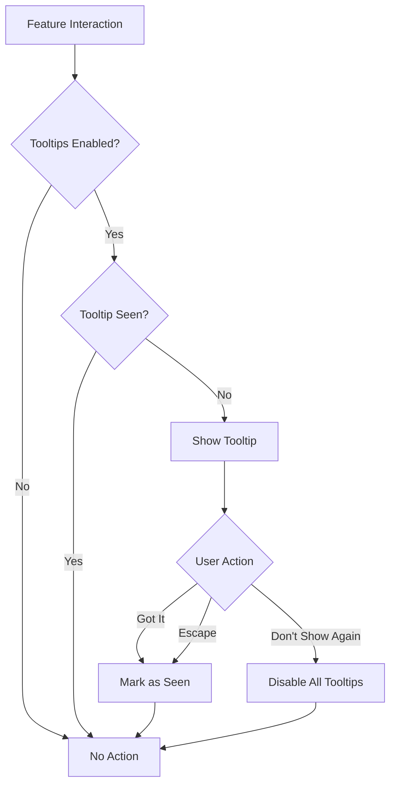

# Onboarding Flow - Design Document

**Project Creator:** Herman Swanepoel  
**Sprint:** Beta Deployment Sprint (Week 3-4)  
**Priority:** HIGH  
**Document Version:** 1.0  
**Last Updated:** 2025-10-13

---

## Overview

The Onboarding Flow system provides a comprehensive, accessible, and engaging first-time user experience for the Enterprise AI Agents VS Code extension. The design follows a progressive disclosure pattern, guiding users through welcome → tour → setup → usage, with full accessibility support and progress persistence.

### Design Principles

1. **Progressive Disclosure** - Information revealed incrementally to avoid overwhelming users
2. **Accessibility First** - WCAG 2.1 AA compliant, keyboard navigable, screen reader compatible
3. **Non-Blocking** - Onboarding runs asynchronously without blocking extension activation
4. **Resumable** - Progress persisted to allow interruption and resumption
5. **Customizable** - Adapts to user skill level and preferences
6. **Privacy-Respecting** - Works offline, respects telemetry preferences

---

## Architecture

### High-Level Architecture

```
┌─────────────────────────────────────────────────────────────┐
│                     Extension Activation                     │
└────────────────────────┬────────────────────────────────────┘
                         │
                         ▼
┌─────────────────────────────────────────────────────────────┐
│                   OnboardingManager                          │
│  ┌──────────────────────────────────────────────────────┐  │
│  │  State Management (OnboardingState)                   │  │
│  │  - Progress tracking                                  │  │
│  │  - Step navigation                                    │  │
│  │  - Configuration storage                             │  │
│  └──────────────────────────────────────────────────────┘  │
│                                                              │
│  ┌──────────────────────────────────────────────────────┐  │
│  │  Flow Orchestration                                   │  │
│  │  - Welcome → Tour → Setup → Complete                 │  │
│  │  - Skip/Resume logic                                  │  │
│  │  - Analytics tracking                                 │  │
│  └──────────────────────────────────────────────────────┘  │
└────────────┬────────────┬────────────┬─────────────────────┘
             │            │            │
             ▼            ▼            ▼
┌─────────────────┐ ┌─────────────┐ ┌──────────────────┐
│  WelcomePanel   │ │  TourPanel  │ │  SetupWizard     │
│  - Webview UI   │ │  - Steps    │ │  - Config forms  │
│  - Actions      │ │  - Progress │ │  - Validation    │
└─────────────────┘ └─────────────┘ └──────────────────┘
             │            │            │
             └────────────┴────────────┘
                         │
                         ▼
┌─────────────────────────────────────────────────────────────┐
│              Integration Layer                               │
│  ┌──────────────────┐  ┌──────────────────────────────┐    │
│  │ Accessibility    │  │ KeyboardNavigation           │    │
│  │ Manager          │  │ Manager                      │    │
│  └──────────────────┘  └──────────────────────────────┘    │
│  ┌──────────────────┐  ┌──────────────────────────────┐    │
│  │ Analytics        │  │ Configuration                │    │
│  │ Service          │  │ Manager                      │    │
│  └──────────────────┘  └──────────────────────────────┘    │
└─────────────────────────────────────────────────────────────┘
```

### Component Hierarchy

```
OnboardingManager (Core Orchestrator)
├── OnboardingState (State Management)
│   ├── Progress Tracker
│   ├── Configuration Store
│   └── Analytics Collector
├── WelcomePanel (Webview)
│   ├── Welcome UI
│   └── Action Handlers
├── TourPanel (Webview)
│   ├── Tour Steps
│   ├── Navigation Controls
│   └── Progress Indicator
├── SetupWizard (Webview)
│   ├── Configuration Forms
│   ├── Validation Logic
│   └── Connection Tester
├── TooltipManager
│   ├── Tooltip Registry
│   ├── Display Controller
│   └── Dismissal Handler
└── QuickStartGuide (Webview)
    ├── Guide Content
    ├── Search Functionality
    └── Navigation
```

---

## Components and Interfaces

### 1. OnboardingManager

**Responsibility:** Central orchestrator for the entire onboarding flow

```typescript
interface IOnboardingManager {
  // Lifecycle
  initialize(): Promise<void>;
  dispose(): void;
  
  // Flow Control
  startOnboarding(options?: OnboardingOptions): Promise<void>;
  resumeOnboarding(): Promise<void>;
  skipOnboarding(): Promise<void>;
  restartOnboarding(): Promise<void>;
  
  // State Management
  getState(): OnboardingState;
  updateProgress(step: OnboardingStep): Promise<void>;
  
  // Analytics
  trackEvent(event: OnboardingEvent): void;
  getAnalytics(): OnboardingAnalytics;
}

interface OnboardingOptions {
  skillLevel?: 'beginner' | 'intermediate' | 'advanced';
  skipWelcome?: boolean;
  skipTour?: boolean;
  skipSetup?: boolean;
}

interface OnboardingState {
  isComplete: boolean;
  isSkipped: boolean;
  currentStep: OnboardingStep;
  completedSteps: OnboardingStep[];
  startTime?: number;
  completionTime?: number;
  skillLevel: 'beginner' | 'intermediate' | 'advanced';
  configuration: Partial<ExtensionConfiguration>;
}

type OnboardingStep = 
  | 'welcome'
  | 'tour-agents'
  | 'tour-modes'
  | 'tour-suggestions'
  | 'tour-discussion'
  | 'tour-analytics'
  | 'setup-backend'
  | 'setup-llm'
  | 'setup-privacy'
  | 'setup-accessibility'
  | 'setup-shortcuts'
  | 'complete';
```

### 2. WelcomePanel

**Responsibility:** Display welcome screen and capture initial user intent

```typescript
interface IWelcomePanel {
  show(): Promise<void>;
  hide(): void;
  onGetStarted: Event<void>;
  onSkipTour: Event<void>;
}

interface WelcomeContent {
  title: string;
  description: string;
  features: FeatureHighlight[];
  actions: WelcomeAction[];
}

interface FeatureHighlight {
  icon: string;
  title: string;
  description: string;
}

interface WelcomeAction {
  label: string;
  command: string;
  primary: boolean;
}
```

### 3. TourPanel

**Responsibility:** Guide users through feature tour with interactive steps

```typescript
interface ITourPanel {
  show(step: TourStep): Promise<void>;
  hide(): void;
  next(): Promise<void>;
  previous(): Promise<void>;
  skip(): Promise<void>;
  getCurrentStep(): number;
  getTotalSteps(): number;
}

interface TourStep {
  id: string;
  title: string;
  description: string;
  icon: string;
  content: TourContent;
  duration?: number; // estimated reading time in seconds
}

interface TourContent {
  type: 'text' | 'image' | 'video' | 'interactive';
  data: string | TourInteractive;
}

interface TourInteractive {
  component: string;
  props: Record<string, any>;
}
```

### 4. SetupWizard

**Responsibility:** Collect and validate user configuration

```typescript
interface ISetupWizard {
  show(step: SetupStep): Promise<void>;
  hide(): void;
  next(): Promise<void>;
  previous(): Promise<void>;
  complete(): Promise<void>;
  validateStep(step: SetupStep): Promise<ValidationResult>;
}

interface SetupStep {
  id: string;
  title: string;
  description: string;
  fields: SetupField[];
  validation?: ValidationRule[];
}

interface SetupField {
  id: string;
  type: 'text' | 'select' | 'checkbox' | 'radio' | 'number';
  label: string;
  placeholder?: string;
  defaultValue?: any;
  options?: SelectOption[];
  helpText?: string;
  required: boolean;
  validation?: ValidationRule[];
}

interface ValidationRule {
  type: 'required' | 'url' | 'port' | 'custom';
  message: string;
  validator?: (value: any) => boolean | Promise<boolean>;
}

interface ValidationResult {
  isValid: boolean;
  errors: ValidationError[];
}

interface ValidationError {
  fieldId: string;
  message: string;
}
```

### 5. TooltipManager

**Responsibility:** Display contextual tooltips for first-time feature usage

```typescript
interface ITooltipManager {
  register(tooltip: TooltipDefinition): void;
  show(tooltipId: string, target: HTMLElement | vscode.Uri): Promise<void>;
  dismiss(tooltipId: string): void;
  dismissAll(): void;
  markAsSeen(tooltipId: string): void;
  isEnabled(): boolean;
  setEnabled(enabled: boolean): void;
}

interface TooltipDefinition {
  id: string;
  title: string;
  description: string;
  shortcut?: string;
  position: 'top' | 'bottom' | 'left' | 'right';
  trigger: 'hover' | 'focus' | 'manual';
  dismissible: boolean;
}

interface TooltipState {
  seenTooltips: Set<string>;
  enabled: boolean;
}
```

### 6. QuickStartGuide

**Responsibility:** Provide searchable reference documentation

```typescript
interface IQuickStartGuide {
  show(section?: string): Promise<void>;
  hide(): void;
  search(query: string): Promise<SearchResult[]>;
  navigate(section: string): void;
}

interface GuideSection {
  id: string;
  title: string;
  content: string;
  subsections?: GuideSection[];
  keywords: string[];
}

interface SearchResult {
  section: GuideSection;
  relevance: number;
  matchedKeywords: string[];
}
```

---

## Data Models

### OnboardingState Storage

```typescript
interface StoredOnboardingState {
  version: string; // Schema version for migration
  isComplete: boolean;
  isSkipped: boolean;
  currentStep: OnboardingStep;
  completedSteps: OnboardingStep[];
  startTime?: number;
  completionTime?: number;
  skillLevel: 'beginner' | 'intermediate' | 'advanced';
  seenTooltips: string[];
  tooltipsEnabled: boolean;
  configuration: Partial<ExtensionConfiguration>;
}
```

**Storage Location:** VS Code Workspace State (`context.workspaceState`)

**Migration Strategy:** Version-based schema migration on load

### Analytics Data Model

```typescript
interface OnboardingAnalytics {
  sessionId: string;
  startTime: number;
  completionTime?: number;
  totalDuration?: number;
  isCompleted: boolean;
  isSkipped: boolean;
  skillLevel: 'beginner' | 'intermediate' | 'advanced';
  steps: StepAnalytics[];
  dropOffPoint?: OnboardingStep;
}

interface StepAnalytics {
  step: OnboardingStep;
  startTime: number;
  completionTime?: number;
  duration?: number;
  skipped: boolean;
  interactions: number;
}
```

**Storage:** 
- Local: Workspace State (always)
- Remote: Telemetry Service (if enabled)

---

## User Interface Design

### Webview Architecture

All onboarding UI components use VS Code Webview API with:
- **React** for component rendering
- **VS Code Webview UI Toolkit** for native-looking components
- **CSS Variables** for theming (respects VS Code theme)
- **Message Passing** for webview ↔ extension communication

### Accessibility Features

#### Keyboard Navigation
- **Tab**: Navigate between interactive elements
- **Enter/Space**: Activate buttons and controls
- **Escape**: Dismiss panels and tooltips
- **Arrow Keys**: Navigate between tour steps
- **Home/End**: Jump to first/last step

#### Screen Reader Support
- **ARIA Labels**: All interactive elements labeled
- **ARIA Live Regions**: Dynamic content announcements
- **ARIA Roles**: Proper semantic roles (dialog, navigation, etc.)
- **Focus Management**: Logical focus order, focus trapping in modals

#### Visual Accessibility
- **High Contrast Mode**: Respects VS Code high contrast themes
- **Color Contrast**: Minimum 4.5:1 ratio for text
- **Focus Indicators**: Visible 2px outline on focused elements
- **Reduced Motion**: Respects `prefers-reduced-motion` media query
- **Font Scaling**: Respects VS Code font size settings

### Responsive Design

- **Minimum Width**: 400px
- **Maximum Width**: 800px (centered)
- **Breakpoints**:
  - Small: < 600px (single column)
  - Medium: 600-800px (two columns)
  - Large: > 800px (optimized layout)

---

## Flow Diagrams

### Main Onboarding Flow



### Tooltip Display Logic



---

## Error Handling

### Error Categories

1. **Initialization Errors**
   - Extension context unavailable
   - State corruption
   - **Recovery**: Reset to default state, log error

2. **Webview Errors**
   - Webview creation failure
   - Message passing errors
   - **Recovery**: Retry once, fallback to command palette

3. **Configuration Errors**
   - Invalid configuration values
   - Backend connection failure
   - **Recovery**: Show validation errors, provide defaults

4. **Storage Errors**
   - State persistence failure
   - **Recovery**: Continue in-memory, warn user

### Error Handling Strategy

```typescript
interface ErrorHandler {
  handle(error: Error, context: ErrorContext): Promise<ErrorResolution>;
}

interface ErrorContext {
  component: string;
  operation: string;
  recoverable: boolean;
}

interface ErrorResolution {
  action: 'retry' | 'fallback' | 'skip' | 'abort';
  message?: string;
  logLevel: 'info' | 'warn' | 'error';
}
```

### User-Facing Error Messages

- **Clear**: Explain what went wrong in plain language
- **Actionable**: Provide next steps or solutions
- **Non-Blocking**: Allow users to continue or skip
- **Accessible**: Announced to screen readers

---

## Testing Strategy

### Unit Tests

**Framework**: Jest + VS Code Extension Test Runner

**Coverage Targets**:
- OnboardingManager: 90%
- State Management: 95%
- Validation Logic: 100%
- Analytics: 85%

**Test Cases**:
- State transitions
- Progress persistence
- Configuration validation
- Analytics tracking
- Error handling

### Integration Tests

**Scenarios**:
1. Complete onboarding flow (happy path)
2. Skip onboarding
3. Resume interrupted onboarding
4. Configuration validation failures
5. Backend connection failures
6. Accessibility features (keyboard navigation)

### Accessibility Tests

**Tools**:
- axe-core (automated accessibility testing)
- Manual screen reader testing (NVDA, JAWS, VoiceOver)
- Keyboard navigation testing

**Checklist**:
- [ ] All interactive elements keyboard accessible
- [ ] Proper ARIA labels and roles
- [ ] Focus management correct
- [ ] Screen reader announcements clear
- [ ] High contrast mode support
- [ ] Color contrast ratios meet WCAG 2.1 AA

### Performance Tests

**Metrics**:
- Initialization time < 100ms
- Webview render time < 200ms
- Step transition time < 50ms
- Memory usage < 10MB
- No memory leaks over 10 transitions

---

## Integration Points

### AccessibilityManager Integration

```typescript
// OnboardingManager registers with AccessibilityManager
accessibilityManager.registerComponent({
  id: 'onboarding',
  keyboardShortcuts: [
    { key: 'Escape', action: 'dismiss' },
    { key: 'Enter', action: 'confirm' },
    { key: 'ArrowRight', action: 'next' },
    { key: 'ArrowLeft', action: 'previous' }
  ],
  ariaLabels: {
    welcome: 'Welcome to Enterprise AI Agents',
    tour: 'Feature Tour',
    setup: 'Setup Wizard'
  }
});
```

### KeyboardNavigationManager Integration

```typescript
// Register keyboard shortcuts
keyboardNavigationManager.registerShortcuts([
  {
    key: 'ctrl+shift+o',
    command: 'enterpriseAI.restartOnboarding',
    description: 'Restart onboarding flow'
  }
]);
```

### Configuration Manager Integration

```typescript
// Save configuration from setup wizard
await configurationManager.update({
  'enterpriseAI.backend.url': setupData.backendUrl,
  'enterpriseAI.llm.provider': setupData.llmProvider,
  'enterpriseAI.privacy.telemetry': setupData.telemetryEnabled,
  'enterpriseAI.accessibility.screenReader': setupData.screenReaderEnabled
});
```

### Analytics Service Integration

```typescript
// Track onboarding events
analyticsService.track('onboarding.started', {
  skillLevel: state.skillLevel,
  timestamp: Date.now()
});

analyticsService.track('onboarding.completed', {
  duration: state.completionTime - state.startTime,
  stepsCompleted: state.completedSteps.length,
  timestamp: Date.now()
});
```

---

## Performance Optimization

### Lazy Loading

- Webview content loaded on-demand
- Tour assets (images, videos) loaded per-step
- Quick Start Guide content loaded on first access

### Caching

- Tour content cached in memory after first load
- Configuration defaults cached
- Tooltip definitions cached

### Resource Management

- Webviews disposed when hidden
- Event listeners cleaned up on disposal
- State persisted asynchronously (non-blocking)

### Bundle Optimization

- Webview assets bundled separately
- Code splitting for tour steps
- Minified production builds

---

## Security Considerations

### Input Validation

- All user inputs sanitized before storage
- URL validation for backend configuration
- Port number validation (1-65535)
- No script injection in webviews

### Data Privacy

- No PII collected in analytics
- Telemetry opt-in required
- Local-first storage
- Encrypted sensitive configuration (API keys)

### Webview Security

- Content Security Policy (CSP) enforced
- No inline scripts
- Nonce-based script loading
- Restricted resource loading

---

## Deployment Strategy

### Rollout Plan

1. **Phase 1**: Internal testing (1 week)
2. **Phase 2**: Beta users (2 weeks)
3. **Phase 3**: General availability

### Feature Flags

```typescript
interface OnboardingFeatureFlags {
  enableWelcomeScreen: boolean;
  enableTour: boolean;
  enableSetupWizard: boolean;
  enableTooltips: boolean;
  enableAnalytics: boolean;
}
```

### A/B Testing

- Test different welcome screen designs
- Test tour step ordering
- Test tooltip timing and positioning

### Monitoring

- Completion rate tracking
- Drop-off point analysis
- Average completion time
- Error rate monitoring
- Accessibility usage metrics

---

## Future Enhancements

### Phase 2 Features

1. **Video Tutorials**: Embedded video demonstrations
2. **Interactive Playground**: Sandbox environment for testing features
3. **Personalized Recommendations**: AI-driven feature suggestions
4. **Multi-Language Support**: Internationalization (i18n)
5. **Gamification**: Badges and achievements for completing onboarding

### Phase 3 Features

1. **Contextual Help**: In-app help based on user actions
2. **Advanced Analytics**: Heatmaps and user journey analysis
3. **Social Proof**: Show popular features and usage statistics
4. **Integration Tutorials**: Step-by-step guides for third-party integrations

---

## Dependencies

### External Dependencies

- `@vscode/webview-ui-toolkit`: ^1.2.0
- `react`: ^18.2.0
- `react-dom`: ^18.2.0

### Internal Dependencies

- AccessibilityManager
- KeyboardNavigationManager
- ConfigurationManager
- AnalyticsService
- WebSocketClient (for backend connection testing)

---

## Risks and Mitigations

### Technical Risks

| Risk | Impact | Probability | Mitigation |
|------|--------|-------------|------------|
| Webview performance issues | High | Medium | Lazy loading, code splitting, performance monitoring |
| State corruption | High | Low | Schema versioning, validation, backup state |
| Accessibility violations | High | Medium | Automated testing, manual testing, WCAG compliance |
| Backend connection failures | Medium | High | Offline mode, clear error messages, troubleshooting guide |

### User Experience Risks

| Risk | Impact | Probability | Mitigation |
|------|--------|-------------|------------|
| Users skip onboarding | Medium | High | Engaging content, quick completion time, replay option |
| Onboarding too long | High | Medium | 5-minute target, skip options, progressive disclosure |
| Confusing UI | High | Low | User testing, clear language, visual hierarchy |

---

## Success Metrics

### Quantitative Metrics

- **Completion Rate**: > 90%
- **Average Completion Time**: < 5 minutes
- **Skip Rate**: < 10%
- **Error Rate**: < 1%
- **Accessibility Compliance**: 100% WCAG 2.1 AA

### Qualitative Metrics

- User satisfaction rating: > 4/5
- Positive feedback on clarity and usefulness
- Reduced support tickets for basic features

---

## Appendix

### Glossary

- **Progressive Disclosure**: Design pattern that reveals information incrementally
- **WCAG**: Web Content Accessibility Guidelines
- **ARIA**: Accessible Rich Internet Applications
- **CSP**: Content Security Policy
- **PII**: Personally Identifiable Information

### References

- [VS Code Extension API](https://code.visualstudio.com/api)
- [VS Code Webview UI Toolkit](https://github.com/microsoft/vscode-webview-ui-toolkit)
- [WCAG 2.1 Guidelines](https://www.w3.org/WAI/WCAG21/quickref/)
- [ARIA Authoring Practices](https://www.w3.org/WAI/ARIA/apg/)

---

**Project Creator:** Herman Swanepoel  
**Document Version:** 1.0  
**Last Updated:** 2025-10-13  
**Status:** Ready for Implementation
