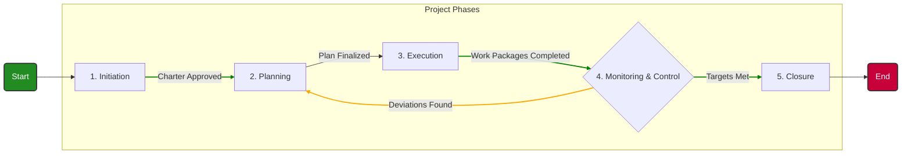
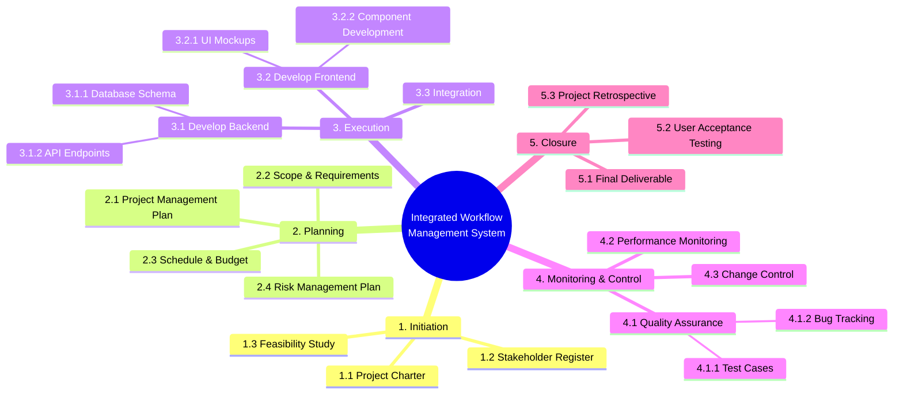
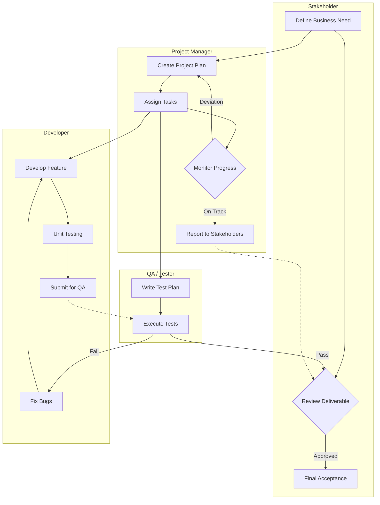
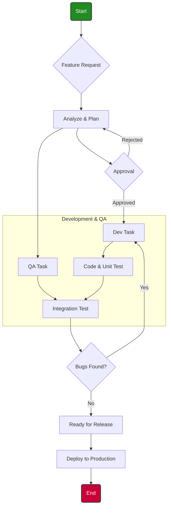
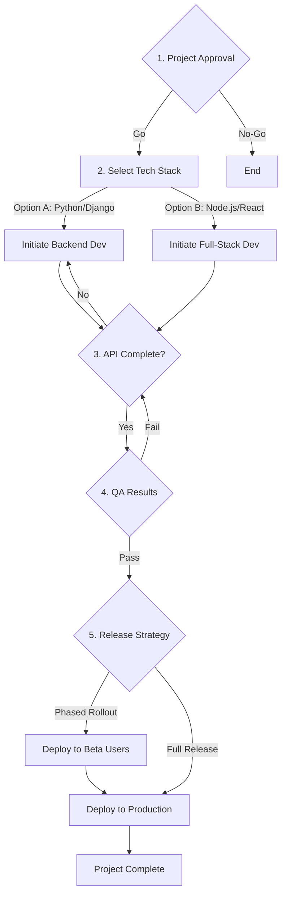
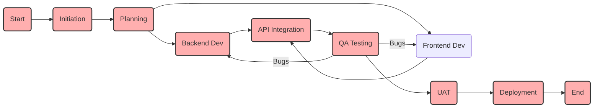

# Integrated Workflow Management System: Enhanced Project Flow Diagrams

This document provides a comprehensive and visually enhanced set of Mermaid diagrams to illustrate the full lifecycle of the **Integrated Workflow Management System**. The diagrams are designed to be interconnected, offering a clear, detailed, and professional view of the project's structure, from initiation to closure.

### 1. Enhanced Project Lifecycle Flowchart

This flowchart illustrates the high-level progression between project phases, incorporating decision points and feedback loops for a more dynamic representation.



### 2. Detailed Work Breakdown Structure (WBS)

This mindmap provides a hierarchical decomposition of the project into key deliverables and work packages for each phase, offering a clear overview of the project's scope.



### 3. Comprehensive Gantt Chart

This Gantt chart provides a detailed project schedule, highlighting critical tasks, dependencies, and milestones across the entire project timeline.

```mermaid
gantt
    title Integrated Workflow Management System - Project Schedule
    dateFormat  YYYY-MM-DD
    axisFormat  %Y-%m
    excludes    weekends, 2025-12-25

    %% Milestones
    :milestone, m1, 2025-11-15, 0d, after task_i2
    :milestone, m2, 2025-12-05, 0d, after task_p3
    :milestone, m3, 2026-02-20, 0d, after task_e3
    :milestone, m4, 2026-03-20, 0d, after task_m3
    :milestone, m5, 2026-03-31, 0d, after task_c3

    section Initiation
    Define Project Charter :crit, done, task_i1, 2025-11-06, 5d
    Identify Stakeholders  :done, task_i2, after task_i1, 3d
    Initiation Complete    :milestone, 2025-11-14, 0d, after task_i2

    section Planning
    Create Project Plan    :crit, active, task_p1, 2025-11-17, 7d
    Define Scope & Schedule:active, task_p2, after task_p1, 5d
    Finalize Budget        :task_p3, after task_p2, 3d
    Planning Complete      :milestone, 2025-12-04, 0d, after task_p3

    section Execution
    Develop Backend API    :crit, task_e1, 2025-12-05, 25d
    Develop Frontend UI    :crit, task_e2, 2025-12-15, 30d
    Integrate Modules      :crit, task_e3, after task_e1, 15d, after task_e2
    Execution Complete     :milestone, 2026-02-19, 0d, after task_e3

    section Monitoring & Control
    QA & Testing           :crit, task_m1, after task_e3, 20d
    User Feedback Loop     :task_m2, after task_m1, 5d
    Bug Fixing             :task_m3, after task_m2, 5d
    Monitoring Complete    :milestone, 2026-03-19, 0d, after task_m3

    section Closure
    Deploy to Production   :crit, task_c1, 2026-03-20, 3d
    Final Report           :task_c2, after task_c1, 5d
    Project Archive        :task_c3, after task_c2, 2d
    Project Closed         :milestone, 2026-03-30, 0d, after task_c3
```

### 4. Detailed Swimlane Diagram (Role-Based Workflow)

This diagram clearly delineates responsibilities across different roles, showing how tasks flow between the Project Manager, Developer, QA, and Stakeholders.



### 5. Advanced Process Flow (BPMN-Style)

This BPMN-style diagram details the feature development process, from planning to deployment, with clear decision points and parallel tasks.



### 6. Strategic Decision Tree

This tree maps critical project decisions, showing the logical flow from initial approval to release strategy based on dependencies and outcomes.



### 7. Detailed PERT / Network Diagram

This diagram illustrates task dependencies and highlights the critical path, providing a clear view of the project's most crucial sequence of tasks.



