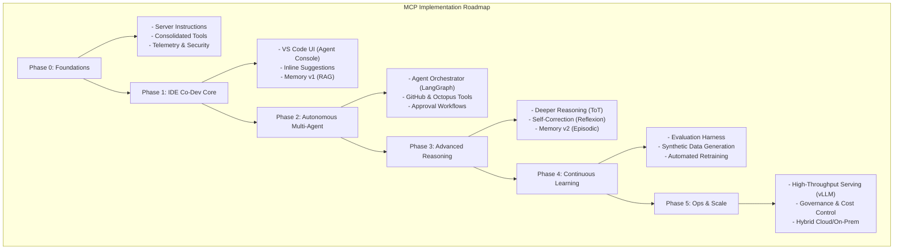

# System Architecture Diagrams

This file contains Mermaid diagrams illustrating the project's implementation roadmap and runtime architecture.

## 1. Phased MCP Implementation Roadmap

This flowchart visualizes the sequential implementation plan from Phase 0 to Phase 5, showing how each stage builds upon the last to create the ultimate MCP.



## 2. System Runtime Interaction Flow

This flowchart illustrates how a user request flows through the entire system, from the VS Code extension to the multi-agent system, the MCP server, and external tools, and finally back to the user.

```mermaid
graph TD
    subgraph "System Runtime Interaction Flow"
        User([User]) -- "1. Makes request<br/>(e.g., 'Refactor this function')" --> VSExtension{VS Code Extension<br/>(Agent Console UI)}

        VSExtension -- "2. Sends task to Orchestrator" --> Orchestrator(Orchestrator Agent)

        Orchestrator -- "3. Decomposes task and dispatches to<br/>specialized agents (in parallel/sequence)" --> Agents(Specialized Agents<br/>- Implementer<br/>- Tester<br/>- Reviewer)

        Agents -- "4. Call tools via MCP" --> MCPServer(MCP Server<br/>Tool Hub)

        MCPServer -- "5. Executes appropriate tool" --> Tools{MCP Tools<br/>- propose_refactor<br/>- run_tests<br/>- query_memory}

        Tools -- "6. Interact with backend services" --> Backends((External Services<br/>- GitHub API<br/>- Vector DB<br/>- Octopus API))

        Backends -- "7. Return data" --> Tools
        Tools -- "8. Return tool output" --> MCPServer
        MCPServer -- "9. Return result to agent" --> Agents

        Agents -- "10. Complete sub-tasks and<br/>report back to Orchestrator" --> Orchestrator

        Orchestrator -- "11. Aggregates results and<br/>sends final response" --> VSExtension

        VSExtension -- "12. Displays result/suggestion<br/>(e.g., code diff, test results)" --> User
    end
```
